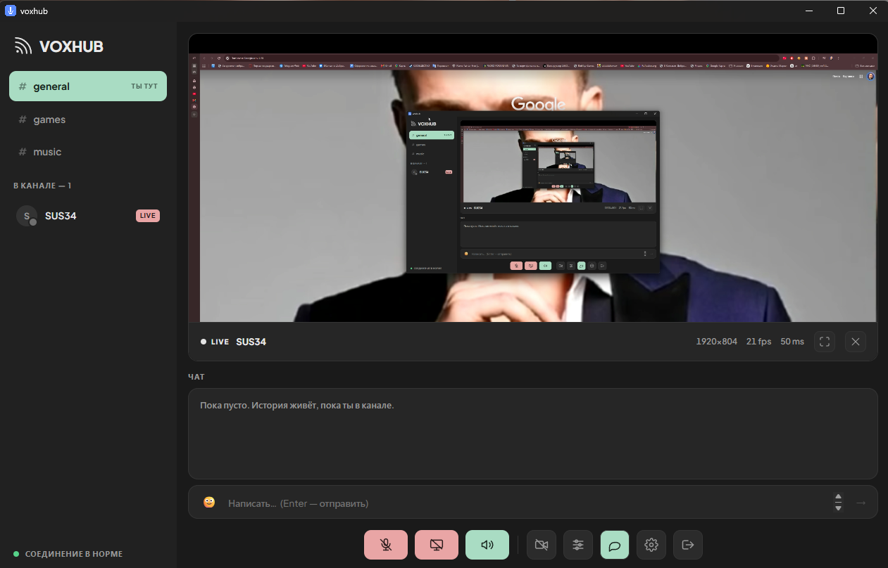

# voxhub

[](https://github.com/sus34/voxhub/actions/workflows/build.yml)

Свой Discord для компании до 5 человек: один ставит и запускает сервер у себя
на компьютере, остальные просто подключаются к нему по ссылке — голос, чат
и демонстрация экрана идут через его машину, без аренды VPS и без сторонних серверов.

`WebRTC` · `LiveKit SFU` · `Node.js` · `React` · `Electron` · `Docker` · `nginx` · `Let's Encrypt`

Написан потому, что бесплатный Discord ограничивает демонстрацию экрана 720p30,
а хотелось 1080p60 со звуком игры. Работает в браузере и отдельным приложением.

**Что внутри, если коротко:**

- **SFU вместо P2P** — при mesh на пятерых стример отдавал бы 4 копии потока
  (32 Mbps upload) и держал несколько энкодеров; через SFU он кодирует один раз
- **Настроенное качество** — три параметра WebRTC, без которых 1080p60
  превращается в кашу ([разбор ниже](#что-даёт-качество))
- **Автообновление клиента и TURN** — тем, у кого провайдер режет UDP,
  всё равно находится путь до комнаты
- **Отлажены нетривиальные сетевые баги** — IPv6-кандидаты с VPN-интерфейса,
  эхо от системного loopback


**Запуск:** один `voxhub.exe`, portable, установка не нужна. Кто-то один
запускает его первым и поднимает комнату, остальные открывают тот же файл
и присоединяются к нему. Разрешения на микрофон и экран выдаются один раз,
а системный звук берётся через loopback — без галочки «поделиться звуком»,
которую все обычно забывают нажать.

---

## Что даёт качество



Строка под видео — живая статистика потока: разрешение, fps, задержка. Если картинка
поплыла, там же появится причина: упирается в CPU кодировщика или в канал. В Discord
такого нет, а при отладке это первое, что хочется видеть.

Всё в [`web/src/quality.js`](web/src/quality.js).

### Видео

1. **`screenShareEncoding`** — битрейт шаринга задаётся отдельным полем, не `videoEncoding`.
   Без него WebRTC сам зажимает поток до ~2.5 Mbps и 1080p60 превращается в кашу.

2. **`degradationPreference`** — LiveKit по умолчанию ставит шарингу `maintain-resolution`
   (режет fps, бережёт пиксели). Для игр это неверно: пресеты «Игры» ставят `maintain-framerate`,
   пресет «Код и текст» оставляет `maintain-resolution`.

3. **`scalabilityMode: 'L1T3'`** — один слой разрешения, три временных. Дефолтный `L3T3_KEY`
   раздробил бы битрейт на три разрешения, что бессмысленно, когда все смотрят на весь экран.

Плюс VP9 — заметно лучше H.264 на тексте и UI.

### Звук

Изначально микрофон публиковался пресетом `speech` — **24 kbps**. Это бюджет телефонного
звонка, отсюда «металлический» неестественный голос. Сейчас три режима:

| Режим | Битрейт | Обработка |
|---|---|---|
| Чистый | 96 kbps | эхоподавление, шумодав, AGC |
| **Тихий** (по умолчанию) | 96 kbps | плюс `voiceIsolation` — ML-фильтр, режет клавиатуру и кулеры |
| Живой | 128 kbps стерео | без обработки — только в наушниках |

`dtx` выключен везде: он экономит трафик, которого не жалко, и срезает первый слог фразы.

### Эхо в демке — и почему наушники не помогали

Звук экрана идёт отдельным стерео-треком без DTX, иначе «детектор тишины» рубит игровой звук.

Но главное здесь — **`restrictOwnAudio: true`** в `SCREEN_AUDIO_CAPTURE`. Захват системного
звука берёт весь вывод звуковой карты, включая голоса, которые проигрывает сам voxhub.
Без этого ограничения стример отправлял всем их собственные голоса обратно, и комната
наполнялась эхом. Это **цифровой** захват выходного потока, а не микрофон, ловящий колонки,
поэтому наушники от него не спасали — частая ложная догадка при диагностике.

В десктопной сборке всё сложнее: `audio: 'loopback'` в Electron — отдельный путь
**в обход** ограничений страницы, так что `restrictOwnAudio` до него не доходит.
Выключение loopback убирало эхо, но вместе с ним и весь звук демки, поэтому он включён
обратно: Windows не отдаёт через Electron захват звука **одного** приложения, только всей
звуковой карты, и «игра без голосов» там технически недостижима.

Кто ловит эхо в десктопе — выводит voxhub на другое устройство, чем игру
(Параметры → Система → Звук → Микшер громкости). Тогда loopback заберёт только игру.
Либо просто снимает галочку «Со звуком» в пикере.

### Пресеты стрима

| Пресет | Битрейт | Для чего |
|---|---|---|
| Игры — 1080p60 | 8 Mbps | по умолчанию |
| Игры — 1440p60 | 12 Mbps | если у всех толстый канал |
| Код и текст — 1440p30 | 6 Mbps | буквы не мылятся |
| Экономный — 720p60 | 3 Mbps | слабый интернет |

Меняются на лету, стрим переподключается на секунду.

---

## Возможности

- Голос, камера, шаринг экрана со звуком
- **Вид как в Discord:** участники плитками сверху, чат снизу. Видео разворачивается
  на весь верх только когда сам нажмёшь «Смотреть», и сворачивается крестиком
- Плитка показывает вебку, если она включена, зелёную рамку у говорящего,
  красную у стримящего и перечёркнутый микрофон у замьюченного
- Каналы (`general`, `games`, `music`) — переход только по явной кнопке, случайным
  кликом из разговора не выкинет
- Текстовый чат со смайликами — **история не хранится**, живёт пока вы в канале
- **Правый клик по участнику** — громкость голоса и звука экрана, мьют, «смотреть стрим»
- **Выбор окна или экрана** в десктопе: свой пикер с превью вместо «всегда весь экран»
- **Полный экран** для стрима — кнопка, двойной клик по видео или клавиша `F`
- **Проверка обновлений** в приложении: сравнивает свою версию с `/api/version`
  и предлагает скачать новую, чтобы не пересылать exe вручную
- Громкость по каждому участнику также в настройках, до 200%
- Выбор микрофона, наушников и камеры
- **Индикатор уровня микрофона** в настройках — сразу видно, берёт он звук или молчит
- **Кнопка «Звук» глушит и микрофон** — как в Discord: не слышишь комнату, значит и не говоришь
- Живая статистика стрима: fps, битрейт, пинг и причина просадки

## Сборка

```bash
cd desktop && npm install && npm start     # запустить из исходников
cd desktop && npm run build                # собрать portable exe
```

Готовый файл — `desktop/dist/voxhub.exe` (~96 МБ, в нём весь Chromium).
Адрес сервера берётся из `VOXHUB_URL` — это адрес компьютера того, кто держит комнату.

Из `desktop/main.js`: постоянные разрешения для своего origin
(`setPermissionRequestHandler`), захват системного звука (`audio: 'loopback'`)
и собственный пикер источников через IPC — системный пикер Windows не сообщает,
что именно выбрали, и звука не давал.

Версия в `package.json` должна совпадать с `DESKTOP_VERSION`, иначе приложение
будет вечно предлагать обновиться.

---

## Известные ограничения

- **История чата не сохраняется** — сообщения идут через data-каналы WebRTC, без базы.
- **Файлы в чат не отправляются** — нужен отдельный сторедж, data-канал для этого мал.
- **Один общий пароль**, без личных аккаунтов. Для пятерых это осознанный размен.
- **Лимит 5 участников** зашит в `deploy/livekit.yaml` (`max_participants`).
- **Нет записи** стримов.
- **Эхо при стриме без наушников.** Если шарить системный звук через колонки, голоса
  друзей вернутся им обратно. Лечится наушниками или галочкой «Со звуком» в настройках качества.

---

## Дизайн


Собран по присланному макету. Ключевые решения оттуда:

| | |
|---|---|
| Поверхности | приглушённый угольный: `#1a1a1a` фон, `#262626` панели |
| Скругления | 8 / 10 / 14px — заметные, не декоративные хайрлайны |
| Границы | 1px, тихие (`#343434`), вместо жирных обводок |
| Акценты | пастельные, один на функцию: мята = активно/ок, охра = стрим, коралл = выключено |
| Шрифт | **Plus Jakarta Sans**, один семейством на все веса |
| Аватары | круглые, с точкой присутствия в углу |
| Кнопки | два блока через разделитель: три частых слева, редкие справа |

Ни градиентов, ни жёстких теней, ни неона. Три прошлых варианта (тёплое аудио-железо,
тёмный неубрутализм) не подошли и в истории не сохранились — этот сделан с макета,
а не по описанию.
