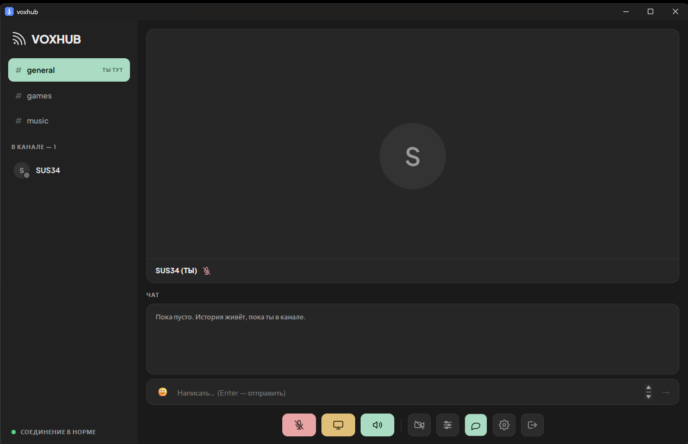
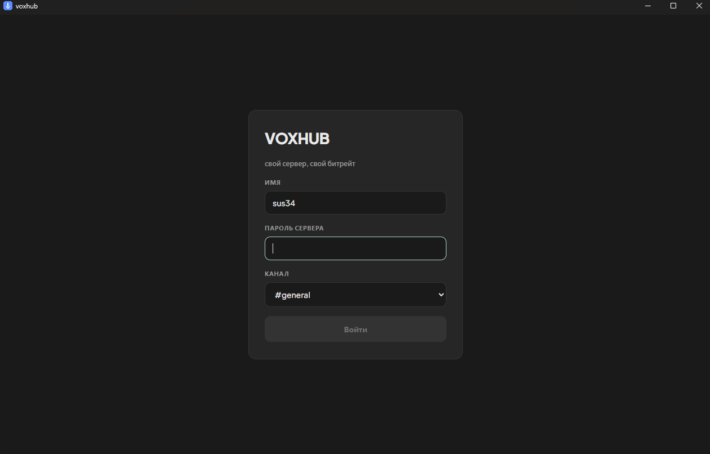

# voxhub

[](https://github.com/sus34/voxhub/actions/workflows/build.yml)

Самописный голосовой сервер со стримом экрана на 5 человек — свой Discord,
развёрнутый на собственном VPS.

`WebRTC` · `LiveKit SFU` · `Node.js` · `React` · `Electron` · `Docker` · `nginx` · `Let's Encrypt`

Написан потому, что бесплатный Discord ограничивает демонстрацию экрана 720p30,
а хотелось 1080p60 со звуком игры. Работает в браузере и отдельным приложением.

**Что внутри, если коротко:**

- **SFU вместо P2P** — при mesh на пятерых стример отдавал бы 4 копии потока
  (32 Mbps upload) и держал несколько энкодеров; через SFU он кодирует один раз
- **Настроенное качество** — три параметра WebRTC, без которых 1080p60
  превращается в кашу ([разбор ниже](#что-даёт-качество))
- **Развёрнуто в проде** — TLS, systemd, автообновление клиента, TURN для тех,
  у кого провайдер режет UDP
- **Отлажены нетривиальные сетевые баги** — два публичных IP, IPv6-кандидаты
  с VPN-интерфейса, эхо от системного loopback

Разделы ниже объясняют не «что сделано», а **почему именно так** — каждое решение
тут появилось из конкретной сломанной ситуации.



**Живёт тут:** https://vox.80.74.28.181.nip.io:8446
**Пароль сервера:** в `server/.env` (`SERVER_PASSWORD`)

Два способа запуска:

- **Десктоп** — `desktop/dist/voxhub.exe`, portable, установка не нужна.
  Разрешения на микрофон и экран выдаются один раз, а системный звук берётся
  через loopback — без галочки «поделиться звуком», которую все забывают нажать.
- **Браузер** — Chrome, там же иконка «Установить» для запуска отдельным окном.

---

## Почему так сделано

**SFU, а не P2P.** При mesh на 5 человек стример отдаёт 4 копии потока (32 Mbps upload при 1080p60)
и держит до 4 энкодеров — игра начинает лагать у него самого. Через SFU он кодирует один раз.

**Порт 8446, а не 443.** На сервере 443 занят xray, 9443 — jira. Медиа это не мешает:
видео идёт по UDP напрямую, через nginx проходит только веб-страница и сигналинг.

**IP 80.74.28.181, а не 103.137.251.214.** На сервере два публичных IP на одном интерфейсе.
Второй заблокирован Роскомнадзором — из России на него не зайти без VPN. При этом 103.x
остаётся default route, поэтому SFU обязан слать медиа с сокета, привязанного к 80.74.28.181
(`ss -ulnp | grep 7882` покажет привязку). Адрес прибит в `deploy/livekit.yaml`.

Если снова начнутся блокировки — менять надо в трёх местах: `deploy/livekit.yaml` (`node_ip`),
`deploy/docker-compose.yml` (`--node-ip`), `server/.env` (`LIVEKIT_URL`), плюс новый
сертификат и `server_name` в nginx.

**Один UDP-порт 7882, а не диапазон.** С диапазоном 50000-50100 клиент первую секунду
скачет между кандидатами (в логах было 6 переключений на коннект). С одним портом — 0.

**TURN включён.** Без него у кого-то из пятерых ICE просто падал с
`could not establish pc connection`: сигналинг проходил, а прямой UDP до него не доходил
(мобильный провайдер, строгий NAT). При этом у другого участника с тем же сервером всё
работало — отсюда легко решить, что «сервер сломан», хотя дело в сети конкретного клиента.
Теперь есть три пути: прямой UDP 7882, TCP 7881 и TURN-релей, причём TLS-вариант на 5349
неотличим от обычного HTTPS и проходит почти любой фильтр.

---

## Что даёт качество

Всё в [`web/src/quality.js`](web/src/quality.js).

### Видео

1. **`screenShareEncoding`** — битрейт шаринга задаётся отдельным полем, не `videoEncoding`.
   Без него WebRTC сам зажимает поток до ~2.5 Mbps и 1080p60 превращается в кашу.

2. **`degradationPreference`** — LiveKit по умолчанию ставит шарингу `maintain-resolution`
   (режет fps, бережёт пиксели). Для игр это неверно: пресеты «Игры» ставят `maintain-framerate`,
   пресет «Код и текст» оставляет `maintain-resolution`.

3. **`scalabilityMode: 'L1T3'`** — один слой разрешения, три временных. Дефолтный `L3T3_KEY`
   раздробил бы битрейт на три разрешения, что бессмысленно, когда все смотрят на весь экран.

Плюс VP9 — заметно лучше H.264 на тексте и UI.

### Звук

Изначально микрофон публиковался пресетом `speech` — **24 kbps**. Это бюджет телефонного
звонка, отсюда «металлический» неестественный голос. Сейчас три режима:

| Режим | Битрейт | Обработка |
|---|---|---|
| Чистый | 96 kbps | эхоподавление, шумодав, AGC |
| **Тихий** (по умолчанию) | 96 kbps | плюс `voiceIsolation` — ML-фильтр, режет клавиатуру и кулеры |
| Живой | 128 kbps стерео | без обработки — только в наушниках |

`dtx` выключен везде: он экономит трафик, которого не жалко, и срезает первый слог фразы.

### Эхо в демке — и почему наушники не помогали

Звук экрана идёт отдельным стерео-треком без DTX, иначе «детектор тишины» рубит игровой звук.

Но главное здесь — **`restrictOwnAudio: true`** в `SCREEN_AUDIO_CAPTURE`. Захват системного
звука берёт весь вывод звуковой карты, включая голоса, которые проигрывает сам voxhub.
Без этого ограничения стример отправлял всем их собственные голоса обратно, и комната
наполнялась эхом. Это **цифровой** захват выходного потока, а не микрофон, ловящий колонки,
поэтому наушники от него не спасали — частая ложная догадка при диагностике.

В десктопной сборке всё сложнее: `audio: 'loopback'` в Electron — отдельный путь
**в обход** ограничений страницы, так что `restrictOwnAudio` до него не доходит.
Выключение loopback убирало эхо, но вместе с ним и весь звук демки, поэтому он включён
обратно: Windows не отдаёт через Electron захват звука **одного** приложения, только всей
звуковой карты, и «игра без голосов» там технически недостижима.

Кто ловит эхо в десктопе — выводит voxhub на другое устройство, чем игру
(Параметры → Система → Звук → Микшер громкости). Тогда loopback заберёт только игру.
Либо просто снимает галочку «Со звуком» в пикере.

### Пресеты стрима

| Пресет | Битрейт | Для чего |
|---|---|---|
| Игры — 1080p60 | 8 Mbps | по умолчанию |
| Игры — 1440p60 | 12 Mbps | если у всех толстый канал |
| Код и текст — 1440p30 | 6 Mbps | буквы не мылятся |
| Экономный — 720p60 | 3 Mbps | слабый интернет |

Меняются на лету, стрим переподключается на секунду.

---

## Возможности

- Голос, камера, шаринг экрана со звуком
- **Вид как в Discord:** участники плитками сверху, чат снизу. Видео разворачивается
  на весь верх только когда сам нажмёшь «Смотреть», и сворачивается крестиком
- Плитка показывает вебку, если она включена, зелёную рамку у говорящего,
  красную у стримящего и перечёркнутый микрофон у замьюченного
- Каналы (`general`, `games`, `music`) — переход только по явной кнопке, случайным
  кликом из разговора не выкинет
- Текстовый чат со смайликами — **история не хранится**, живёт пока вы в канале
- **Правый клик по участнику** — громкость голоса и звука экрана, мьют, «смотреть стрим»
- **Выбор окна или экрана** в десктопе: свой пикер с превью вместо «всегда весь экран»
- **Полный экран** для стрима — кнопка, двойной клик по видео или клавиша `F`
- **Проверка обновлений** в приложении: сравнивает свою версию с `/api/version`
  и предлагает скачать новую, чтобы не пересылать exe вручную
- Громкость по каждому участнику также в настройках, до 200%
- Выбор микрофона, наушников и камеры
- **Индикатор уровня микрофона** в настройках — сразу видно, берёт он звук или молчит
- **Кнопка «Звук» глушит и микрофон** — как в Discord: не слышишь комнату, значит и не говоришь
- Живая статистика стрима: fps, битрейт, пинг и причина просадки

## Десктопное приложение

```bash
cd desktop && npm install && npm start     # запустить из исходников
cd desktop && npm run build                # собрать portable exe
```

Готовый файл — `desktop/dist/voxhub.exe` (~96 МБ, в нём весь Chromium).
Адрес сервера берётся из `VOXHUB_URL`, по умолчанию боевой.

Что оно даёт поверх браузера — в `desktop/main.js`: постоянные разрешения для своего
origin (`setPermissionRequestHandler`), захват системного звука (`audio: 'loopback'`)
и собственный пикер источников через IPC — системный пикер Windows не сообщает, что
именно выбрали, и звука не давал.

Версия в `package.json` должна совпадать с `DESKTOP_VERSION` в `server/.env`, иначе
приложение будет вечно предлагать обновиться. После сборки положить exe в
`/opt/voxhub/download/voxhub.exe`.

---

## Что где крутится

| Что | Где | Управление |
|---|---|---|
| LiveKit SFU | docker, host network | `cd /opt/voxhub/deploy && docker compose ...` |
| Токен-сервер | systemd, порт 3000 | `systemctl {status,restart} voxhub` |
| TLS + прокси | nginx, порт 8446 | `/etc/nginx/sites-available/voxhub.conf` |
| Сертификат | Let's Encrypt | автопродление через certbot |

Порты: **8446/tcp** (веб+сигналинг), **7882/udp** (медиа), **7881/tcp** (fallback для строгих сетей).

Расход: LiveKit ест ~46 МБ RAM, токен-сервер ~73 МБ. Узкое место — не CPU, а канал.

---

## Обновить

```bash
cd web && npm run build
```

Дальше залить `web/dist` в `/opt/voxhub/web/dist` (старую папку `assets` перед этим удалить,
иначе копятся мёртвые бандлы), `server/src` в `/opt/voxhub/server/src`, и `systemctl restart voxhub`.

## Локальная разработка

```bash
cd server && npm install && cp .env.example .env && npm run dev
```

```bash
cd web && npm install && npm run dev
```

Vite поднимается на 5173 и проксирует `/api` на 3000. `LIVEKIT_URL` в `.env` можно оставить
боевым — локальный клиент будет ходить на живой SFU.

---

## Известные ограничения

- **История чата не сохраняется** — сообщения идут через data-каналы WebRTC, без базы.
- **Файлы в чат не отправляются** — нужен отдельный сторедж, data-канал для этого мал.
- **Один общий пароль**, без личных аккаунтов. Для пятерых это осознанный размен.
- **Лимит 5 участников** зашит в `deploy/livekit.yaml` (`max_participants`).
- **Нет записи** стримов.
- **Эхо при стриме без наушников.** Если шарить системный звук через колонки, голоса
  друзей вернутся им обратно. Лечится наушниками или галочкой «Со звуком» в настройках качества.

---

---
## Дизайн



Собран по макету, который прислал заказчик. Ключевые решения оттуда:

| | |
|---|---|
| Поверхности | приглушённый угольный: `#1a1a1a` фон, `#262626` панели |
| Скругления | 8 / 10 / 14px — заметные, не декоративные хайрлайны |
| Границы | 1px, тихие (`#343434`), вместо жирных обводок |
| Акценты | пастельные, один на функцию: мята = активно/ок, охра = стрим, коралл = выключено |
| Шрифт | **Plus Jakarta Sans**, один семейством на все веса |
| Аватары | круглые, с точкой присутствия в углу |
| Кнопки | два блока через разделитель: три частых слева, редкие справа |

Ни градиентов, ни жёстких теней, ни неона. Три прошлых варианта (тёплое аудио-железо,
тёмный неубрутализм) забракованы заказчиком и в истории не сохранились — этот сделан
с макета, а не по описанию.
